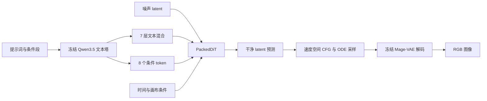

# SakuraMoon

SakuraMoon 是动漫风格文生图的训练与本地推理实现：冻结的 Qwen3.5 文本塔和 Mage-VAE，配合可训练的联合文本/图像 DiT，以流匹配目标学习干净 latent 的预测。

代码包含数据服务、训练、checkpoint 恢复、采样、生成评估和独立推理。`PackedDiT` 是内部类名，使用标准的变长序列打包；不是一种新的注意力算法。

> 权重不在 Git 仓库中。实际模型结构以 checkpoint 的 `model/config.json` 为准；冻结编码器必须与训练时一致。本项目尚未提供根目录代码许可证，正式发布前需由作者明确代码、权重与数据的授权范围。

## 从这里开始

| 需要做什么 | 文档 / 入口 |
|---|---|
| 看懂模型和张量流向 | [模型架构与图示](docs/architecture.md) |
| 用现有 checkpoint 生成图片 | [推理指南](docs/inference.md)，`python -m sakuramoon.cli.infer` |
| 配置 NVIDIA / Hygon DCU 环境 | [运行环境与部署](docs/runtime.md) |
| 查配置继承、训练入口和恢复约束 | [配置与恢复契约](docs/config-and-resume.md) |
| 理解相机取景和 RoPE 坐标 | [相机取景](docs/camera-viewport.md) |
| 查训练资产及发布边界 | [模型说明](docs/model-card.md) |

## 独立推理

在 Linux 或 WSL2 中运行。先安装适合硬件的 PyTorch，随后安装 `pyproject.toml` 的基础依赖；现有 DTK 环境保持厂商提供的 torch/FLA/DAS 组合，不要用通用 CUDA wheel 覆盖。

```bash
# 从代码仓库根目录运行；已有虚拟环境也可以直接使用。
export PYTHONPATH="$PWD/src${PYTHONPATH:+:$PYTHONPATH}"

python scripts/infer.py \
  --root /path/to/runtime \
  --checkpoint /path/to/output_model/your-checkpoint \
  --prompt "A small white cat under a blooming cherry tree, anime illustration." \
  --attention-backend sdpa \
  --output-dir outputs/inference
```

`--root` 下应有：

```text
model/
  qwen_3.5_2B/       训练时使用的文本编码器与 tokenizer
  vae/              训练时使用的 Mage-VAE
```

推理只加载模型权重，不加载优化器，不需要训练数据、W&B 或 ModelScope token。每张图片同时写入 PNG 内嵌参数和 JSON sidecar；已有同名结果不会被覆盖。

- 支持完整 checkpoint 根目录或独立的 `model/` 目录。
- 默认读取相邻的 `resolved_config.toml`；模型导出不带此文件时，传 `--config config/inference.toml`。
- NVIDIA 的可移植入口是显式 `--attention-backend sdpa`；DCU 可选择 `--attention-backend flash` 使用已安装的 DAS FlashAttention-2。
- `--profile preview` 为 Euler 28 步；`balanced` 为 Heun 25 步（49 次网络调用）；参数来自配置，可以覆盖 `--steps` 和 `--guidance-scale`。

完整参数、条件词与尺寸说明见[推理指南](docs/inference.md)。

## 模型概览



当前生产结构为 hidden size 2560、20 层、20 个 query head / 5 个 KV head、head dimension 128。每个 128 通道 VAE latent 单元成为一个图像 token；512×512 图像对应 32×32、共 1024 个图像 token。其余细节、训练图和公式见[架构文档](docs/architecture.md)。

## 训练与评估

训练使用配置继承链，完整模型与优化器状态写入 `output_model/`。生产路径当前围绕 DCU 的 DAS 内核和 CMuon / TorchAO 优化器构建。NVIDIA 独立推理及模型前后向可使用 SDPA；这不等于已验证 NVIDIA 多卡生产续训或跨厂商优化器状态恢复。

```bash
# 必须先准备配置、模型、数据服务及对应的硬件环境。
PYTHONPATH=src uv run --no-sync python -m sakuramoon.cli.train \
  --config train_g1.toml --config-root config --root /path/to/runtime \
  --resume /path/to/runtime/output_model/g1/your-checkpoint
```

`config/base.toml` 中的 `BENCHMARK_*` / `DECISION_*` 值是必须完成标定的模板项，不能直接启动训练。已有配置多为历史生产配方，不是适合任意机器的默认值。新机器先核对 batch、worker 数、缓存容量和内核依赖，再运行 preflight。

- `cli.generation_eval`：独立 checkpoint 的 FID / IS / KID / CMMD 评估。
- `cli.concept_eval`：概念条件评估。
- `cli.vae_reconstruction`：VAE 重建评估。
- `scripts/training_stack.sh`：管理数据服务和训练进程；默认不上传 checkpoint。上传需要显式设置 `PUBLISH_ENABLED=1` 与 `REPO_ID`。

## 代码地图

```text
config/                  配置模板和训练配方；inference.toml 是独立推理预设
src/sakuramoon/
  cli/                   命令行入口
  inference.py           不依赖训练数据与优化器的生成流程
  model/                 DiT、注意力、MLP、输出头和深度增长
  conditioning/          文本混合、条件 token、打包、RoPE 与全局条件
  encoders/              冻结文本编码器、Mage-VAE、iREPA 教师包装
  objective/             流匹配与 iREPA 损失
  sampling/              Euler / Heun 求解器与 profile
  checkpoint/            架构、权重、训练状态及完整性契约
  data/                  caption、图像预处理、分片缓存与数据服务
  optim/                 AdamW8bit / CMuon、分组和数值保护
  train/                 preflight、训练循环、采样、评估调度
  eval/                  生成质量和概念评估
  telemetry/             本地指标与可选 W&B
src/causal_conv1d.py      Qwen 的 FLA / PyTorch 卷积兼容入口
scripts/                 运维和数据工具；发布、迁移必须显式配置目标
```

历史 `reports/`、`dev-tools/` 和测试目录是已有工程材料，不代表当前版本全部验证通过；运行结果以当前检查为准。新生成的权重、日志、测试输出和报告应放在仓库外或已忽略的目录。
