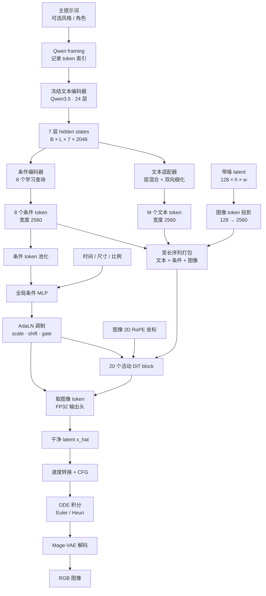
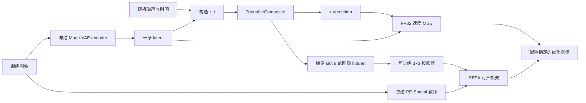

# 模型架构与数据流

本文对应当前实现，而不是最初的设计草图。结构入口是 `checkpoint/artifact.py`，运行组合是 `train/step.py::TrainableComposite`。加载现有权重时，以 `model/config.json` 的架构、活动 slot 和 dtype 为准。

## 端到端结构

每张图的采样过程中，文本特征只计算一次。图中的 DiT 主干在每个采样步重复调用，由采样器更新当前 latent 和时间。



`h = H/16`、`w = W/16`。输入尺寸必须是 16 的倍数。图像 token 数为 `h*w`，没有额外的 patch embedding 或空间 token 合并。

## 组件与参数约定

| 组件 | 当前生产结构 | 是否训练 |
|---|---|---|
| 文本编码器 | Qwen3.5 架构的 2B 文本塔；24 层，hidden 2048 | 冻结 |
| 文本适配 | 各层 FP32 RMSNorm；共享 2048→1024 投影；8 组层混合；16 头双向细化；1024→2560 | 是 |
| 条件编码 | 8 个学习查询；hidden 1024，16 头；输出 2560 | 是 |
| DiT | hidden 2560；20 个活动 block；SwiGLU intermediate 6912 | 是 |
| GQA | 20 个 query head、5 个 KV head、head_dim 128 | 是 |
| 输出头 | RMSNorm、全局 scale/shift、FP32 Linear 2560→128 | 是 |
| Mage-VAE | latent 128 通道、16 倍空间下采样；单步卷积编码/解码 | 冻结 |
| iREPA 投影器 | 3×3 Conv，2560→768；训练辅助分支 | 启用 iREPA 时训练 |
| iREPA 教师 | PE-Spatial-B16-512 | 冻结，仅训练需要 |

该 20 层结构的可训练部分为 1,570,747,194 个参数；加上 iREPA 投影器的 17,695,488 个参数后，共 1,588,442,682 个。混合 BF16/FP32 参数张量占 3,228,621,032 字节；这不是推理或训练的峰值显存，还需计入编码器、激活、梯度和优化器状态。

这些宽度和 tokenizer framing 是已训练权重的接口约定，不能把它们当作待删除的环境硬编码。可以迁移的是磁盘路径、设备、内核实现和运行参数；改变模型维度或文本 framing 需要相应的新训练或显式权重迁移。

部署资产中的文本编码器 README 表示其为第三方派生权重。因此这里的“Qwen3.5”描述架构，不保证该目录等于官方原始权重；推理必须使用训练时相同的资产。详见[模型说明](model-card.md)。

## 一个 DiT block

```mermaid
%%{init: {"markdownAutoWrap": false, "flowchart": {"wrappingWidth": 360}}}%%
flowchart LR
    X[输入 hidden] --> N1[RMSNorm + AdaLN]
    N1 --> QKV[Q / K / V 投影]
    QKV --> Rope[QK 归一化与 2D RoPE]
    Rope --> Attn[双向 GQA]
    Attn --> Gate[sigmoid 内容门控 + 输出投影]
    Gate --> R1[条件 gate × growth_alpha + 残差]
    X --> R1
    R1 --> N2[RMSNorm + AdaLN]
    N2 --> MLP[SwiGLU]
    MLP --> R2[条件 gate × growth_alpha + 残差]
    R1 --> R2
    R2 --> Y[输出 hidden]
```



内容门控和 AdaLN 的残差 gate 是两种不同的门。前者根据 token hidden 调制注意力输出，后者由时间/画布/条件生成。增长期还会对新增 slot 的分支施加 `growth_alpha`。

## 打包、坐标和注意力后端

每个样本的序列是 `[主文本 token | 条件 token | 图像 token]`。`conditioning/packing.py` 将它们拼为扁平张量，并携带样本边界、图像 span 和宿主端长度。注意力不得跨越样本边界，CFG 的条件/无条件分支也相互隔离。

RoPE 将 128 维 head 分成不旋转的 32 维、Y 轴 48 维和 X 轴 48 维，`theta=1000`。图像使用 cell 中心与面积归一的二维坐标；文本和条件 token 的坐标为零。相机取景将图像坐标仿射映射回全画布，不改变 token 打包顺序。

| 后端 | 执行方式 | 选择方式 |
|---|---|---|
| DAS FlashAttention-2 varlen | DCU 生产内核，直接处理扁平序列与边界 | 现有训练默认；推理 `--attention-backend flash` |
| PyTorch SDPA | 逐样本切片调用 SDPA，保持 20Q/5KV GQA 与样本隔离 | 推理 `--attention-backend sdpa` |
| DenseDiT reference | 带 padding/mask 的密集参考结构 | 参考验证配置，不是推理 CLI 的后端转换方式 |

SDPA 路径保留原 PackedDiT 模型和 tensor 名称，仅改变注意力运算的执行方式。没有把原 checkpoint 改写为密集模型，也不会在内核失败时静默降级。`fa4_varlen_attention` / `FA4VarlenGQAAttention` 是保留的历史函数/类名；它们不意味着需要安装 FlashAttention-4。

PyTorch 在 HIP 平台也使用 `torch.cuda` 与 `cuda:N` 设备字符串。相关接口见 [HIP 说明](https://docs.pytorch.org/docs/stable/notes/hip.html)和 [SDPA 文档](https://docs.pytorch.org/docs/stable/generated/torch.nn.functional.scaled_dot_product_attention.html)。

## 训练目标与采样公式

设干净 latent 为 `x`，噪声为 `epsilon`，时间 `t` 从 0 走到 1：

```text
epsilon ~ Normal(0, noise_scale²)
t_train = sigmoid(Normal(0,1) * p_std + p_mean)
z_t = t * x + (1-t) * epsilon
v(x_hat, z_t, t) = (x_hat - z_t) / max(1-t, t_eps)
loss = mean((v(x_hat,z_t,t) - v(x,z_t,t))²)
v_cfg = v_unconditional + cfg_scale * (v_conditional - v_unconditional)
```

`t_eps` 截断的是分母 `1-t`，不是把 `t` 限制为大于 0.05。loss、速度转换、CFG 和 ODE 状态使用 FP32；DiT 主线性层及编码器使用 BF16。CFG 先分别把两个 x 预测转换成速度，再组合。

采样在 `[0,1]` 线性时间网格上积分。Euler 每步调用一次网络；`heun_final_euler` 在最后一步用 Euler，其余用 Heun，因此 N 步对应 `2N-1` 次网络调用。最后的 latent 经 Mage-VAE 解码为 `[-1,1]` 范围图像，再映射、裁剪为 uint8。

## 训练辅助和 checkpoint



iREPA 的 slot 捕获、投影器和随训练步数变化的权重只用于训练。独立推理保留 checkpoint 中的投影器以严格匹配权重，但不加载教师、不执行辅助分支。

20 层不一定对应连续的 `slot_00` 到 `slot_19`。深度增长使用稳定 slot 名字，保存 `active_slot_ids` 和 `new_slot_ids`；不得仅凭层数重建活动序列。增长尚未完成时，推理还必须恢复 sidecar 中的 alpha，或者显式给出 `--growth-alpha`。

冻结 Qwen/VAE 不包含在 trainable composite 的权重分片内；仅发布 DiT checkpoint 不足以复现完整生成流程。
