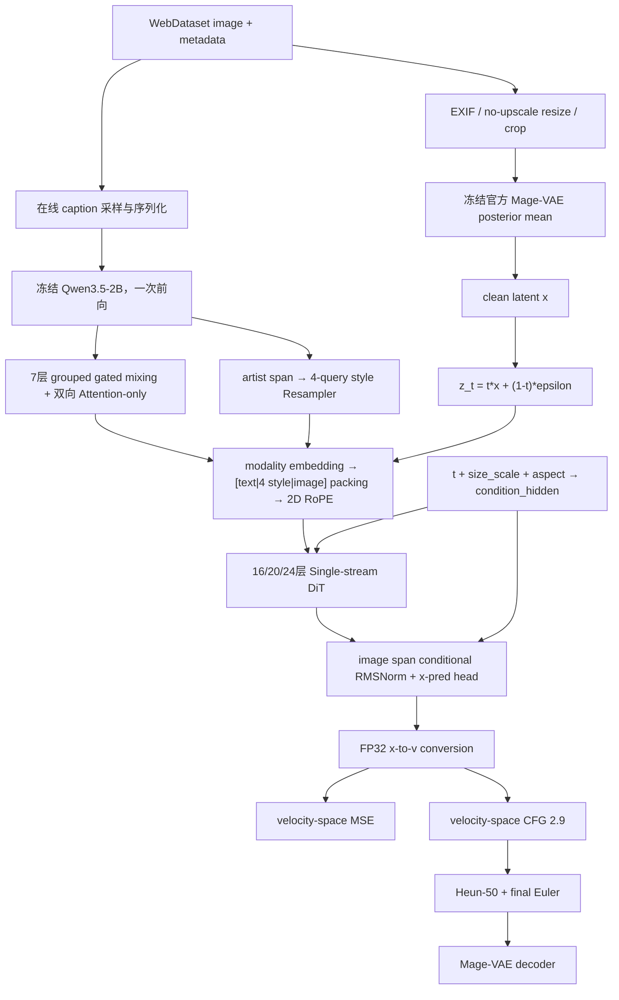

Here is the result of "view" for the Page with URL https://app.notion.com/p/3acae967ecf281d69eb2c080768c6cd1 as of 2026-07-29T06:42:42.045Z:
<page url="https://app.notion.com/p/3acae967ecf281d69eb2c080768c6cd1" icon="✅">
<ancestor-path>
<parent-page url="https://app.notion.com/p/3aaae967ecf281c8a10bf797b47982ff" title="新模型架构决策中心"/>
</ancestor-path>
<properties>
{"title":"当前确定方案 v2（会话重整）"}
</properties>
<content>
<callout icon="✅" color="green_bg">
	**用途：**本页依据截至 2026-07-29 的完整会话讨论重新整理，只保留用户明确批准且仍然有效的方案。后续明确修订覆盖早期决定；“待验证”表示需要实现或实机证据，不表示架构仍未决定。
</callout>
关联执行清单：<mention-page url="https://app.notion.com/p/3acae967ecf28174bbaafbd053308860"/>
# 0. 判定规则与当前边界
1. **确定方案：**会话中已明确批准，或者是被后续组件正式继承的接口。
2. **已取代：**早期方案与后续决定冲突时，只保留后者作为实现依据。
3. **待验证：**结构已经决定，但仍需单元测试、canary、目标机 benchmark 或质量验收。
4. **尚未决定：**只剩除整体条件外的 dropout 数值，见第 13 节与配套清单。Artist 路径与文本长度桶已由后续会话锁定。
5. 实现配置不得从原组件的候选、推荐、早期记录或历史决定中自动取值。
6. **本地模型资产边界：**Qwen TE 与 Mage-VAE 已分别位于 `model/qwen_3.5_2B/` 和 `model/vae/`。代码只检查固定目录和加载必需文件是否存在，然后直接本地加载；不维护资产 manifest，不计算或核对本地文件 bytes/SHA-256，不建立 capability、TOCTOU 或防伪造层。禁止自动下载、缺失补下载、联网替换或 fallback，必需文件缺失时在加载前硬失败。
7. **参考工程硬边界：**`reference/` 仅供人工理解和对照，可以完全不使用。生产代码、测试、preflight、训练和运行时绝对不得 import、执行或调用其中任何代码；实现必须以本地现行决定与独立实现为准。
# 1. 项目目标与硬约束
- 从零训练二次元垂类文生图基础模型，不继承现有 DiT 权重。
- 目标机器为单机 4×RTX 5090，每卡 32 GB；训练窗口 90–180 天；数据约 11M WebDataset 样本。
- 512 等效面积是首版最低成品分辨率；768/1024 仅作为 512 成品通过后的手工可选阶段。
- 能力优先级固定为：tag 控制 → 审美质量 → 长文本/NL → 原生宽高比 → 高分辨率。
- Anima 只作为效果方向参照，不设必须追平的硬指标。
来源：<mention-page url="https://app.notion.com/p/3aaae967ecf281ba8f73fac2f9e4c4f3"/>
# 2. 端到端架构主线

<callout icon="⚠️" color="yellow_bg">
	图中 clean endpoint 必须写作 `x`。`z_t=t*x+(1-t)*epsilon` 中 `t=0` 是纯噪声，`t=1` 是 clean latent；不得把 clean latent 误标为 `z0`。
</callout>
# 3. 图像预处理与 VAE
- 唯一 VAE 为 Microsoft 官方 Mage-VAE；训练时冻结，使用官方实现和权重，不采用第三方转换版。
- 在线执行动态 resize/crop 后编码，取 posterior mean，`sample_posterior=false`；不预编码。
- 原生 latent 为 `128 channels @ H/16 × W/16`；DiT `patch_size=1`，不再做额外 patchify。
- EXIF 后转 RGB；严格保持宽高比，只缩小、不放大、不拉伸、不补边。不能覆盖当前 bucket 的样本在该阶段跳过并按原因计数。
- crop 被视为完整目标画面；源图尺寸、缩放和 crop offset 只进审计记录，不进入 RoPE 或全局尺寸条件。
- VAE 重建集固定 2,000 张：1,600 张分层随机覆盖主分布，400 张覆盖线稿、眼睛、手部、发丝、文字、复杂服装、极端比例等风险场景。
- 门槛：Median LPIPS≤0.03、P95 LPIPS≤0.08、Median SSIM≥0.94、严重重建错误率\<1%、明显细节损失率\<5%。
来源：<mention-page url="https://app.notion.com/p/3aaae967ecf2816096f0ea37634a2f7e"/>
# 4. Caption、Qwen 与条件采样
## 4.1 固定文本编码器
- 唯一 checkpoint 是已准备在 `model/qwen_3.5_2B/` 的本地 Qwen；不对本地文件做 repo/revision/SHA/tokenizer hash 审计，也不静默替换、下载或回退到其他 Qwen。
- Qwen 冻结、`eval()`、`inference_mode()`、`use_cache=false`，不启用视觉路径；每个样本只做一次在线文本前向。
- 不调用会插入 thinking 的 chat template，不执行生成；最终 token 序列必须不含 `<think>` 与 `</think>`。
## 4.2 固定 framing
```plain text
<|im_start|>system
Describe the image by detailing the color, shape, size, texture, quantity, text, spatial relationships of the objects and background:<|im_end|>
<|im_start|>user
{caption_body}<|im_end|>
<|im_start|>assistant
```
- 训练、验证、推理和 CFG 空条件共用同一个手工 serializer。
- 不追加有效 `<|endoftext|>`；它只能作为 masked padding id。prefix/suffix 长度由锁定 tokenizer 启动时计算并断言，不复制 Krea 2 的硬编码下标。
- CFG 空条件是完整模板中的 `caption_body=""`，不是单独 EOT 或零长度文本。
## 4.3 固定 caption body 语义
- 主文本 caption 类别骨架固定为 `nsfw → character → copyright → general → NL`；类别之间不 shuffle，只在类别内部按可复现 seed shuffle。Artist 不进入主文本 caption，只进入同一次 Qwen 序列的辅助 Artist segment。
- 所有非空 tags 用精确的 `, ` 连接；tags 与 NL 同时存在时使用双换行 `\n\n`。不加入 `Tags:`、`Description:` 或类别标签。
- 五个 NL 候选分支只在当前可用分支中等概率选一个；单样本最多包含一个 NL。
- `candidate_tags` 不是第五类文本，而是四类 tag 的删除掩码；candidate dropout 命中时跨四类删除 canonical match，不追加副本、不改 NL。
- `all_condition` dropout 固定为 0.10；命中后 body 为空且 style 使用 null tokens。其余类别、candidate 和 NL dropout 数值仍待配置。
- 截断只在完整字段或完整 tag 边界发生：优先保留高优先级 tags，先裁 NL 尾部，禁止半个 tag/token 语义单元。
来源：<mention-page url="https://app.notion.com/p/3aaae967ecf281fba3cfe0f5dc53fece"/> · <mention-page url="https://app.notion.com/p/3aaae967ecf281db800cfb1d6545f880"/>
# 5. 文本聚合与 Style 分支
## 5.1 主文本分支
- 从 Qwen 24 个 blocks 中取 `after block 2, 4, 8, 12, 16, 20, 24` 七个 hidden states。
- 各层独立 RMSNorm 后共享投影 `2048→1024`；1024 通道分 8 组，每个 token、每组对 7 层做 gated softmax mixing。
- 使用最深层残差锚点，随后执行一个 NoPE、非因果、只屏蔽 padding 的双向 Attention-only MHA block。
- 最终把每个有效文本 token 投影到 DiT 宽度 2560；不做句级 pooling，不使用完整的 layer-axis Transformer。
## 5.2 Style 分支
- Artist 只进入 style 分支，不进入主文本聚合。在线 serializer 同时产出主文本、Artist 辅助 segment、`main_token_indices` 与 `artist_token_indices`，不得依赖事后字符串搜索。
- Artist 辅助 segment 位于所有主分支消费 token 之后；冻结 Qwen 只前向一次。主文本聚合只 gather `main_token_indices`，style 分支从同次前向的 7 层 hidden states gather `[B,A,7,2048]`，从结构上避免因果 Artist 信息回流主分支。
- style 处理链固定为：共享 RMSNorm + learned layer embedding → 展平 `artist token × layer` → 4 个 learned queries 单层 cross-attention → residual Style MLP `1024→2048→1024` → `Linear(1024,2560)`。
- 输出恰好 4 个独立 style tokens；无 Artist、Artist dropout 或全条件 dropout 时使用 4 个 learned null style tokens，且这些 tokens 始终有效。
- 首版保持在线构造与编码，不做第二次 Qwen，也不建立离线 style embedding cache。
来源：<mention-page url="https://app.notion.com/p/3abae967ecf28104ad74d1b843728be4"/>
# 6. Token 接口、Packing 与 RoPE
- modality embedding、sequence packing、RoPE 是三个独立步骤，不得在实现或架构图中合并成一个不透明操作。
- 三类输入分别加 learned text/style/image modality embedding，再按 `[valid text | 4 style | image]` 拼接；无分隔 token。
- 单样本内全部有效 token 双向可见；不同样本由 `cu_seqlens`/document boundaries 隔离。text padding 在进入 DiT 前移除；dense bucket 仅作 correctness/runtime fallback。
- text/style 的 2D 坐标固定为 `(0,0)`，不增加文本 1D RoPE；image token 使用 cell-center 2D 坐标。
- 面积归一化坐标：`r_y=sqrt(H/W)`、`r_x=sqrt(W/H)`；`y_i=(2(i+0.5)/H-1)*r_y`，`x_j=(2(j+0.5)/W-1)*r_x`。
- 每头 128 维分为 25% NoPE、37.5% y-RoPE、37.5% x-RoPE，即 `32/48/48`；坐标乘固定 `position_scale=16`，`theta=1000`，频率跨 Q/K heads 与 x/y 共享。
- Q/K 先执行 head-dim RMSNorm，再应用 RoPE；不得复制 KV heads。
- 全局尺寸只传目标画布：`size_scale=0.5*log2((H_px*W_px)/512^2)`、`aspect=log2(W_px/H_px)`；CFG 两支值完全相同。
- Qwen/组件04使用离散长度桶 dense 前向，DiT 默认 varlen packing。最终锁定 `text_condition_max=512`，桶为 `[64,128,192,256,320,384,448,512]`。
- 桶长表示去掉固定 34-token prefix 后的全部 condition tokens；当前协议含 5 个 suffix tokens及 Artist 辅助 segment，完整 Qwen dense lengths 为 `[98,162,226,290,354,418,482,546]`。prefix/suffix 数量仍须由锁定 tokenizer 启动时实测断言。
- 超过512的约0.516%样本按完整字段/tag边界截断。先为协议边界和Artist辅助segment保留预算，再裁NL尾部与低优先级主文本tags；不得截掉半个tag或唯一style来源。无论Artist布局如何，都复用本扫描结果，不重新扫描。目标机benchmark只决定varlen/dense执行路径，不改变512上限与8桶。
来源：<mention-page url="https://app.notion.com/p/3abae967ecf281de8dafc6dbecd04fe6"/>
# 7. DiT 主干
- Single-stream full attention；最终固定 `hidden_size=2560`、`head_dim=128`、`20 Q heads / 5 KV heads`、SwiGLU `intermediate_size=6912`。
- 深度只按 `16→20→24` 增长，宽度和输入/输出投影从一开始固定；24 层完整模型连同外围可训练模块约 1.85B–1.90B。
- attention 同时保留 token-dependent sigmoid content gate 与 condition-dependent attention/MLP residual gates；新增 block 另有非学习式 growth switch。
- block 内 Q/K/V、attention gate/output 和 SwiGLU projections 全部 `bias=false`；attention/MLP dropout 均为 0。
- 全部 RMSNorm `eps=1e-6`、FP32 累计、BF16 输出；Q/K 独立 head-dim RMSNorm并跨 heads 共享参数，V 不归一化。
- 生产 attention 目标为 FA4 varlen 原生 BF16 GQA；dense SDPA 是唯一 reference/fallback。FA4 版本与 `pack_gqa` 必须在目标机验证后锁定，禁止静默慢路径。
来源：<mention-page url="https://app.notion.com/p/3abae967ecf281809823e98b5d91222e"/>
# 8. 全局条件与输出 Head
- `t∈[0,1]` 使用 256 维 sinusoidal embedding；`size_scale` 与 `aspect` 各用 64 维固定 embedding。
- 拼接后通过 `384→1024→1024` 两层 SiLU condition MLP 得到 `condition_hidden`。
- block modulation 使用共享 `1024→6d` projection 加每 block 独立 `6d` bias，切为 attention/MLP 的 scale、shift、gate；共享 projection 与 per-block bias 均 zero-init。
- final head 另有独立路径：`condition_hidden→SiLU→Linear(1024,5120)` 产生 final scale/shift；不得复用 block 的 `6d` tensor。该 projection zero-init。
- 只读取 image span：条件化 final RMSNorm 后接 `Linear(2560,128,bias=true)`，weight/bias zero-init；无额外 patchify、learned variance、epsilon 或 velocity 输出通道。
- checkpoint 明确记录 `prediction_type=x` 与 `out_channels=128`。
来源：<mention-page url="https://app.notion.com/p/3abae967ecf2815b84fbda3c707728c2"/>
# 9. 训练目标、CFG 与采样
- clean latent 记为 `x`，噪声为 `epsilon~N(0,I)`，训练状态为 `z_t=t*x+(1-t)*epsilon`；`t=0` 噪声、`t=1` clean。
- timestep 采用 JLT 参数 `P_mean=-0.8`、`P_std=0.8`；`noise_scale=1`、`t_eps=0.05`。
- 网络输出 `x_pred`，再以 FP32 计算 `v_pred=(x_pred-z_t)/max(1-t,0.05)`；训练损失是 velocity-space FP32 MSE，并严格先做 per-sample mean、再做 global sample mean。
- CFG 必须先分别把 conditional/unconditional 的 `x_pred` 转成 velocity，再做 `v_cfg=v_uncond+2.9*(v_cond-v_uncond)`；默认全时间区间 guidance，不做 CFG rescale。
- 正式评估使用 linear-time Heun-50 + final Euler，solver state 为 FP32，共 99 NFE；快速预览结果不得混入质量验收。
- 不维护在线 EMA；PMA-10 simple mean 只用于同拓扑、同稳定窗口的评估/发布。resume 与 stage transition 只使用 raw checkpoint。
来源：<mention-page url="https://app.notion.com/p/3abae967ecf28167a869fb61c5ff0e96"/>
# 10. 分辨率课程、Bucket 与深度增长
- 首版阶段顺序固定：`S0 1GPU/16L/256 → S1 4GPU/16L/256 → G1 4GPU/20L/256 → S2 4GPU/20L/512 → G2 4GPU/24L/512 → S3 4GPU/24L/512`。
- 每次 transition 只改变 world size、深度或分辨率中的一个主轴；达到门槛后只输出 `stage_ready`，由用户手工 finalize 和启动下一阶段。
- 512 bucket 以 `A0=512^2`、步长 `q=32`、短边下限 256、最大 4:1 和转置闭包生成 17 个近等 image-token shapes；256/768/1024 按比例缩放相同形状集合。
- bucket 选择顺序固定为：实际尺寸 → 全部 no-upscale eligible buckets → 最近宽高比 → 等比 cover resize → 可复现均匀随机 crop。裁剪保留率低于 0.80 时跳过。
- 新 stage 使用新的 stage/pass/seed 从完整 manifest 重开；不把 topology 或分辨率变化伪装成旧 data pass 的原位 resume。
- 两次增长各均匀插入 4 个随机初始化新 slots；旧 slots 不改名、不复制、不删除。旧 optimizer state 按 canonical FQN 保留，新 slots state 为空。
- growth alpha 固定为半余弦 `0→1`，时长为新深度阶段计划 updates 的 2%，并限制在 1,000–5,000 个成功 optimizer updates；alpha 不参与学习。
- 预算同时使用有效样本暴露、实际 DiT FLOPs 与 successful updates；具体各 stage 数值待 benchmark 后填入显式 overlay。
- `irepa.enabled=false`；H1 768 与 H2 1024 默认禁用，只能从已接受的 512 raw checkpoint 手工启动。
来源：<mention-page url="https://app.notion.com/p/3abae967ecf28103be8feea5e27f21e1"/> · <mention-page url="https://app.notion.com/p/3abae967ecf2816da90ccbee372b27c4"/>
# 11. 数据、缓存与验证隔离
- 唯一远端数据源为 ModelScope `leafmoone/webdataset_danbooru`；manifest 固定不可变 revision、path、release、bytes、SHA-256 与 samples。
- 整 shard 下载到本地后校验再发布；单机只有一个下载/cache 协调器，LRU quota 为 300–500 GiB，具体高低水位和并发由冷缓存 benchmark 锁定。
- 初始每 GPU 2 个 persistent workers、每 rank 2 个有界 ready batches；最终值通过 1/2/3 worker 和 queue-depth sweep 选择。
- CPU 负责 JSON、验证排除、dropout、caption、tokenize、单次 decode、EXIF、resize/crop 和 bucket 路由；每 rank 在线运行冻结 Qwen/Mage-VAE，默认与 DiT 在同一 GPU 串行。
- 不建立跨 batch 的 text embedding、latent 或 activation cache；当前也不重新对 11M 数据去重。
- 恢复语义为 shard-level at-least-once：完成 shard 不重读，活跃 shard 从头重放；不序列化预取队列和 shuffle buffer。
- 训练验证集恰好 2,000 个全局唯一 `id`，按 `release × aspect bucket × caption availability` 分层抽取，独立 validation shard；在进入 shuffle buffer 前排除，训练消费必须为零。
来源：<mention-page url="https://app.notion.com/p/3aaae967ecf281db800cfb1d6545f880"/>
# 12. 优化器、并行、Checkpoint 与生产门槛
- S0 使用单卡原生模型；S1 起同机四卡 DDP。冻结 Qwen/VAE 位于 DDP wrapper、optimizer 与 checkpoint 之外，每 rank 各一份。
- 可训练 composite 包含 DiT、文本聚合/投影、style 分支、condition encoder 和 output head。
- 单个 TorchAO AdamW8bit：`lr=2e-5`、`betas=(0.9,0.95)`、`eps=1e-8`、`block_size=256`、`bf16_stochastic_round=true`。
- 大矩阵 parameter/gradient 使用 BF16；RMSNorm、门控、标量、style/null tokens、condition 与小 head 等敏感参数使用 FP32。矩阵 weight decay=0.01，敏感参数不 decay；FP32 global norm clip=1.0。
- 所有 rank 共享隔离的 optimizer stochastic-round RNG，训练 RNG 各自独立；每步验证 model、moments、per-parameter step 与 SR state 不分叉。
- WSD scheduler：首次 S0 进行 2,000 个成功 updates warmup，随后跨 stages 保持 2e-5；最终由用户单独启动 cosine decay 至 2e-6。
- raw checkpoint 使用 canonical-FQN sharded Safetensors model、完整 TorchAO optimizer sidecar、独立 trainer/data/growth/RNG state、checksum、manifest、临时目录与 `COMPLETE` 原子提交。
- full raw checkpoint 每 1,000 successful updates 或 6 小时先到者保存；stage finalize、增长关键点和 pre-decay 强制保存。模型目录删除续训 sidecar 后仍须可独立推理。
- 数据供给必须≥12 samples/s 且 ready-queue wait\<2%；完整四卡 20/24层 512 训练必须≥6 samples/s。低于 4 停止，4–6 只允许优化，不得长期生产。
- 每卡峰值显存≤27.2 GB，并满足目标 local/global batch；不得 OOM、host swap、nonfinite 自动续跑或任一 rank 状态分叉。
- 低中风险实现按里程碑包统一完成 AI/模型正确性与 Infra/性能审查；kernel、optimizer、DDP、checkpoint、growth/transition、训练 step、故障注入和正式 stage canary 保持逐任务独立双审。证据按风险提供，普通 CPU 任务不要求独立 timing artifact，before/after 只用于真实性能变更。
来源：<mention-page url="https://app.notion.com/p/3abae967ecf281ebadadd176e1b492db"/>
# 13. 尚未决定的接口
1. **Dropout 数值：**除 `all_condition=0.10` 外，general、artist、character、copyright、nsfw、candidate_source 和五个 NL key 的概率。
Artist 只走 style 分支、在线 segment metadata、无第二次 Qwen/离线 style cache，以及 `text_condition_max=512` 与 8 个长度桶均已锁定，不再作为待确认项；后续变更应作为新的架构变更记录。
# 14. 明确覆盖关系
- “约 1B” → **1.85B–1.90B**。
- 四卡 FSDP2 baseline → **S0 单卡原生、S1 起四卡 DDP**；FSDP2 仅在 DDP 硬门槛失败后重新决策。
- bitsandbytes AdamW8bit → **TorchAO AdamW8bit + BF16 stochastic rounding**。
- 复制相邻层/学习式 alpha → **随机初始化新层 + 固定半余弦 alpha ramp**。
- PMA 用于下一 stage 初始化 → **raw checkpoint 负责 resume/transition，PMA 只用于评估/发布**。
- 旧 5 bucket 草案 → **17 个近等 image-token buckets**。
- 全部固定长度 dense padding → **Qwen 离散长度桶 + DiT varlen packing，dense 保留为 fallback**。
- stage 切换 data pass 待定 → **transition 后以新 stage/pass/seed 从完整 manifest 重开**。
- tags/NL 单换行 → **双换行 ****`\n\n`**。
- 第三方转换 VAE 候选 → **只用 Microsoft 官方 Mage-VAE**。
# 15. 变更记录与来源
- 2026-07-29：按完整会话导出重新判定“已批准 / 后续覆盖 / 尚未决定”，移除对已批准架构的重复确认请求。
- 2026-07-29：补入架构图评审结论：clean latent `x`、modality/packing/RoPE 分层、独立 final modulation head、velocity-space CFG、双重 zero-init 与固定 growth alpha。
- 2026-07-29：用户锁定 Artist 仅进入 style 分支；serializer 在线记录 segment/token indices，同一 Qwen 只前向一次，不做 style cache。文本预算固定为 condition 512 和 8 桶，不因 Artist 路径变化重新扫描。
- 2026-07-30：用户确认 Qwen TE 与 Mage-VAE 为 `model/` 下已准备本地资产，锁定只校验/只本地加载且禁止下载或 fallback；`reference/` 收窄为纯人工理解/对照，禁止任何工程路径导入、执行或调用其中代码。
- 会话证据：Codex 会话导出附件 `pasted-text.txt`；原组件页保留讨论过程和外部参考。
## Notion 原始组件
- <mention-page url="https://app.notion.com/p/3aaae967ecf281ba8f73fac2f9e4c4f3"/>
- <mention-page url="https://app.notion.com/p/3aaae967ecf2816096f0ea37634a2f7e"/>
- <mention-page url="https://app.notion.com/p/3aaae967ecf281fba3cfe0f5dc53fece"/>
- <mention-page url="https://app.notion.com/p/3abae967ecf28104ad74d1b843728be4"/>
- <mention-page url="https://app.notion.com/p/3abae967ecf281de8dafc6dbecd04fe6"/>
- <mention-page url="https://app.notion.com/p/3abae967ecf281809823e98b5d91222e"/>
- <mention-page url="https://app.notion.com/p/3abae967ecf2815b84fbda3c707728c2"/>
- <mention-page url="https://app.notion.com/p/3abae967ecf28167a869fb61c5ff0e96"/>
- <mention-page url="https://app.notion.com/p/3abae967ecf28103be8feea5e27f21e1"/>
- <mention-page url="https://app.notion.com/p/3abae967ecf2816da90ccbee372b27c4"/>
- <mention-page url="https://app.notion.com/p/3aaae967ecf281db800cfb1d6545f880"/>
- <mention-page url="https://app.notion.com/p/3abae967ecf281ebadadd176e1b492db"/>
</content>
</page>
